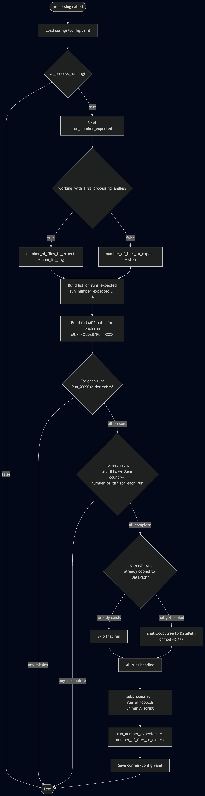
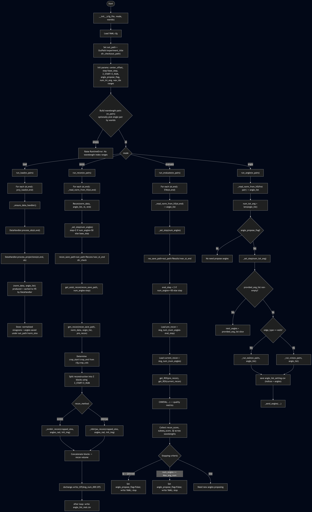

## Notebooks instructions

2. Run the notebook ai_automated_loop.ipynb
  - define in first cell:
    - are we running in debug mode (False/True)
    - are we live (if True, Shimin's code will be executed)

  - define parameters
    - the IPTS (ex: 37493)
    - sample name (ex: 'this is my sample')
    - experiment conditions (ex: 'T10C')
    - rotation stage number (ex: 1)
    - number of obs requested (ex: 3)
    - proton charge (in coulombs) for each run (ex: 0.1)
    - number of TIFF each run will produce (ex: 2628)
    - first run number (ex: 7864)
    - [optional] list of initial angles (in degrees) (ex: [45, 75, 90])

3. Run the next cell (launching acquisition of open beams, 0 and 180 degrees)
This is the pre-processing step (described in detail below)

4. The next cell (to run on a regular basis) will check the state of the pre-processing step and inform when all the OBs and 0, 180 degrees have been found and moved to their final location.

5. Run next cell to calculate the center of rotation using the 0 and 180 degrees projections

6. Launch the AI loop by running the last cell

---

## Pre-processing One-Page Checklist

Use this section as a quick operator runbook.

### A) Before starting

1. Update configs/config.yaml:
  - EIC token (ask Ray) and IPTS
2. Confirm pre-processing input folder exists:
  - /SNS/VENUS/IPTS-<ipts>/shared/autoreduce/images/tpx1/raw/ct
3. Confirm write access to:
  - /data/VENUS/IPTS-<ipts>

### B) Start pre-processing loop

1. Edit cron:
  - crontab -e
2. Enable this line:
  - \* \* \* \* \* /SNS/VENUS/shared/software/git/hype_scripts/scripts/cron_job_script_pre_processing.sh > /dev/null
3. Save and exit.

### C) What each cron tick does

1. Append timestamp to logs/cron_jobs.txt.
2. Run:
  - /home/j35/.pixi/bin/pixi run --manifest-path /SNS/VENUS/shared/software/git/hype_scripts python /SNS/VENUS/shared/software/git/hype_scripts/scripts/ai_processing_loop.py -p
3. ai_processing_loop.py (pre_processing):
  - exits early if ai_pre_process_running is false
  - waits for Run_<run_number_expected>
  - waits until TIFF count reaches number_of_tiff_for_each_run
  - copies run folder to DataPath and chmod -R 777
  - appends copied path to:
    - ob_local_path (for OB runs)
    - 0_and_180_local_path (for last 2 runs)
  - increments run_number_expected by 1

### D) Completion rule

When the last expected pre-processing run is collected:

1. ai_pre_process_running is set to false.
2. working_with_first_processing_angles is set to false.
3. run_number_expected is incremented.
4. config is copied to /data/VENUS/shared and ~/.
5. /data/VENUS/shared/software/hype_scripts/hype_loop/hyperct_toolkit_depoly/hyperct_loop_autogen/ini_exp_hype.sh is launched.

### E) Live status checks

1. Cron heartbeat:
  - tail -n 20 /SNS/VENUS/shared/software/git/hype_scripts/logs/cron_jobs.txt
2. Main pre-processing log:
  - tail -n 200 /data/VENUS/IPTS-<ipts>/logs/ai_processing_loop.log
3. Current config state:
  - grep -E "ai_pre_process_running|run_number_expected|starting_run_number|working_with_first_processing_angles" /SNS/VENUS/shared/software/git/hype_scripts/configs/config.yaml

### F) Quick troubleshooting

1. No new runs processed:
  - confirm cron line is enabled
  - confirm Run_<run_number_expected> exists in MCP folder
  - confirm TIFF count reached expected threshold
2. Repeatedly waiting on same run:
  - verify run_number_expected in config.yaml
  - verify detector finished writing files
3. Permission/copy errors:
  - verify write access under /data/VENUS/IPTS-<ipts>
4. Stop loop safely:
  - set ai_pre_process_running: false in config.yaml

## processing() – One-Page Checklist

Use this section as a quick operator runbook for the main CT acquisition loop.

### A) Before starting

1. Confirm pre-processing is complete:
   - `ai_pre_process_running: false` in configs/config.yaml
   - `ob_local_path` and `0_and_180_local_path` are populated
2. Confirm configs/config.yaml fields are set correctly:
   - `ai_process_running: true`
   - `run_number_expected` = first CT run number to collect
   - `working_with_first_processing_angles: true` (first batch uses `num_ini_ang` files)
   - `num_ini_ang` = number of initial angles
   - `step` = number of angles per subsequent batch
   - `number_of_tiff_for_each_run` = expected TIFF count per run
   - `DataPath` = target output folder on hype
3. Confirm the AI reconstruction script is accessible:
   - `/data/VENUS/shared/software/run/run_ai_loop.sh`

### B) Start main processing loop

1. Edit cron:
   - `crontab -e`
2. Enable this line (and disable the pre-processing one):
   - `* * * * * /SNS/VENUS/shared/software/git/hype_scripts/scripts/cron_job_script_full_loop.sh > /dev/null`
3. Save and exit.

### C) What each cron tick does

1. Runs `ai_processing_loop.py` (no `-p` flag) → `processing()`.
2. Exits early if `ai_process_running` is false.
3. Reads `run_number_expected` and determines batch size:
   - First pass: `num_ini_ang` runs
   - Subsequent passes: `step` runs
4. Checks that all `Run_XXXX` folders in the batch exist under MCP folder.
5. Checks that all TIFF files are present in each folder.
6. For each new run: copies folder to `DataPath` with `chmod -R 777`.
7. Launches `run_ai_loop.sh` (Shimin AI reconstruction).
8. Increments `run_number_expected` by batch size and saves config.

### D) Live status checks

1. Cron heartbeat:
   - `tail -n 20 /SNS/VENUS/shared/software/git/hype_scripts/logs/cron_jobs.txt`
2. Main processing log:
   - `tail -n 200 /data/VENUS/IPTS-<ipts>/logs/ai_processing_loop.log`
3. Current config state:
   - `grep -E "ai_process_running|run_number_expected|working_with_first_processing_angles" /SNS/VENUS/shared/software/git/hype_scripts/configs/config.yaml`
4. Check copied runs in DataPath:
   - `ls /data/VENUS/IPTS-<ipts>/`

### E) Quick troubleshooting

1. No new runs processed:
   - Confirm `ai_process_running: true` in config.yaml
   - Confirm `Run_<run_number_expected>` exists in MCP folder
   - Confirm TIFF count reached `number_of_tiff_for_each_run`
2. Stuck on same run number:
   - Check detector is done writing files
   - Verify `run_number_expected` value in config.yaml
3. Shimin script not launching:
   - Confirm `run_ai_loop.sh` is executable and path is correct
4. Stop loop safely:
   - Set `ai_process_running: false` in config.yaml

---

## Pre-processing Detail Workflow

This workflow describes what happens each time the cron pre-processing trigger runs
scripts/ai_processing_loop.py with the -p flag.

### 1) Trigger and entrypoint

1. Cron executes scripts/cron_job_script_pre_processing.sh.
2. The shell script appends a timestamp to logs/cron_jobs.txt.
3. The shell script runs:
  /home/j35/.pixi/bin/pixi run --manifest-path /SNS/VENUS/shared/software/git/hype_scripts python /SNS/VENUS/shared/software/git/hype_scripts/scripts/ai_processing_loop.py -p
4. In ai_processing_loop.py, -p dispatches execution to pre_processing().

### 2) Early guards and setup

1. ai_processing_loop.log is trimmed to the last 1000 lines.
2. configs/config.yaml is loaded.
3. If ai_pre_process_running is false, the routine exits immediately.
4. Expected run list is built from:
  starting_run_number ... starting_run_number + number_of_obs + 1
  where:
  - OB runs = all except last 2
  - last 2 runs = 0 and 180 degree runs
5. DataPath is created if missing, then permissions are recursively opened under /data/VENUS/IPTS-<ipts>.

### 3) Per-iteration collection logic

For current run_number_expected:

1. Check for MCP folder Run_<run_number_expected>.
2. Ensure all TIFF files exist (must reach number_of_tiff_for_each_run).
3. Build short destination name from first TIFF filename.
4. If destination folder was not already copied, copy run folder to DataPath and chmod -R 777.
5. Update config lists:
  - If run is in OB range, append destination path to ob_local_path.
  - If run is in last two runs, append destination path to 0_and_180_local_path.

### 4) Completion condition

If run_number_expected equals the last expected run:

1. Set ai_pre_process_running = false.
2. Set DataPath to OUTPUT_FOLDER_ON_HYPE.
3. Increment run_number_expected by 1.
4. Set working_with_first_processing_angles = false.
5. Save config.
6. Copy config to /data/VENUS/shared and ~/.
7. Launch /data/VENUS/shared/software/auto_gen_run_scrs/ini_exp_hype.sh.

Otherwise:

1. Increment run_number_expected by 1.
2. Save config.
3. Exit, waiting for next cron cycle.

### 5) Flow diagram



## Processing Detail Workflow

This workflow describes what happens each time the cron main-loop trigger runs
scripts/ai_processing_loop.py without the -p flag.

### 1) Trigger and entrypoint

1. Cron executes scripts/cron_job_script_full_loop.sh.
2. The shell script appends a timestamp to logs/cron_jobs.txt.
3. The shell script runs:
  /home/j35/.pixi/bin/pixi run --manifest-path /SNS/VENUS/shared/software/git/hype_scripts python /SNS/VENUS/shared/software/git/hype_scripts/scripts/ai_processing_loop.py
4. In ai_processing_loop.py, no -p flag dispatches execution to processing().

### 2) Early guards and setup

1. configs/config.yaml is loaded.
2. If ai_process_running is false, the routine exits immediately.
3. run_number_expected is read.
4. Batch size is determined:
  - If working_with_first_processing_angles is true: batch = num_ini_ang
  - Otherwise: batch = step
5. list_of_runs_expected is built:
  run_number_expected, run_number_expected+1, ..., run_number_expected+N-1

### 3) Per-batch collection logic

For all runs in list_of_runs_expected:

1. Check that every Run_XXXX folder exists under MCP_FOLDER.
  - If any is missing, exit immediately.
2. Check that every run folder has all TIFF files written (count >= number_of_tiff_for_each_run).
  - If any is incomplete, exit immediately.
3. For each run, derive the short destination name from the first TIFF filename.
4. If the destination folder does not already exist in DataPath:
  - Copy the run folder to DataPath.
  - chmod -R 777 on the copied folder.
5. If the destination already exists, skip that run.

### 4) Post-batch actions

Once all runs in the batch are confirmed and copied:

1. Launch /data/VENUS/shared/software/run/run_ai_loop.sh (Shimin AI reconstruction).
2. Increment run_number_expected by the batch size.
3. Save configs/config.yaml.
4. Exit, waiting for next cron cycle.

### 5) Flow diagram




## Shimin Notes

## - instruction at hype
0. config.ymal copied to /data/VENUS/shared/software/
1. run "/data/VENUS/shared/software/hyperct_toolkit_depoly/hyperct_loop_autogen/ini_exp_hype.sh" to automatically generate running scripts
2. Cron job start
3. Cron job run: "/data/VENUS/shared/software/run_ai_loop.sh"


### 0. In ai_automated_loop missing:
  - define paremeter: sample name, user_condition, number of init angles, acquire type (pCharge/time), sample postion files paths
  - remove experiment titile
  - 

### 1. @Hype the hyperct related scripts are saved at /data/VENUS/shared/software/
```
/data/VENUS/shared/software
├─ hyperct_toolkit_depoly
│  ├─ ainct_lib
│  ├─ ctqa
│  ├─ hyperct_loop_autogen
│  ├─ pixi.lock
│  └─ pixi.toml
├─ logs
├─ run
│  ├─ ang_prop.sh
│  ├─ eva.sh
│  ├─ load_1.sh
│  └─ rec_1.sh
├─ scrs
│  ├─ ai_loop.py
│  ├─ AIRobo.py
│  └─ sync_data.py
└─ run_ai_loop.sh
```
### 2. hyperct_toolkit_deploy saved all dependents and pixi enviornment
### 3.  ./scrs/: HyperCT main scripts
- AIRobo.py: there are four modes: 1). Load 2). Recon 3). Evaluate 4). Angle Propose
- ai_loop.py is the script calling AIRobo to run different mode at different node
- sync_data.py: move the results back to /SNS/VENUS/IPTS-XXXX/shared/hyperct_output

### 4. ./run/: bash scripts to submit different mode to mulitple node
- run /data/VENUS/shared/software/hyperct_toolkit_depoly/hyperct_loop_autogen/ini_exp_hype.sh to automatically generate running scripts
### 5. excute the /data/VENUS/shared/software/run_ai_loop.sh to start the hyperct
