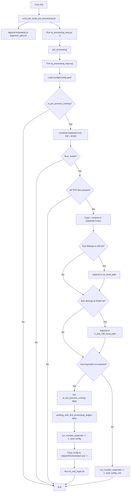

## Pre-processing One-Page Checklist

Use this section as a quick operator runbook.

### A) Before starting

1. Update configs/config.yaml:
  - EIC token (ask Ray) and IPTS
  - starting_run_number and run_number_expected
  - EIC_vals.number_of_obs
  - ai_pre_process_running: true
  - DataPath (target output folder)
2. Confirm pre-processing input folder exists:
  - /SNS/VENUS/IPTS-<ipts>/shared/autoreduce/images/tpx1/raw/ct
3. Confirm write access to:
  - /data/VENUS/IPTS-<ipts>

### B) Start pre-processing loop

1. Edit cron:
  - crontab -e
2. Enable this line:
  - * * * * * /SNS/VENUS/shared/software/git/hype_scripts/scripts/cron_job_script_pre_processing.sh > /dev/null
3. Save and exit.

### C) What each cron tick does

1. Append timestamp to logs/cron_jobs.txt.
2. Run:
  - /home/j35/.pixi/bin/pixi run --manifest-path /SNS/VENUS/shared/software/git/hype_scripts python /SNS/VENUS/shared/software/git/hype_scripts/scripts/ai_processing_loop.py -p
3. ai_processing_loop.py (pre_processing):
  - exits early if ai_pre_process_running is false
  - waits for Run_<run_number_expected>
  - waits until TIFF count reaches number_of_tiff_for_each_run
  - copies run folder to DataPath and chmod -R 777
  - appends copied path to:
    - ob_local_path (for OB runs)
    - 0_and_180_local_path (for last 2 runs)
  - increments run_number_expected by 1

### D) Completion rule

When the last expected pre-processing run is collected:

1. ai_pre_process_running is set to false.
2. working_with_first_processing_angles is set to false.
3. run_number_expected is incremented.
4. config is copied to /data/VENUS/shared and ~/.
5. /data/VENUS/shared/software/auto_gen_run_scrs/ini_exp_hype.sh is launched.

### E) Live status checks

1. Cron heartbeat:
  - tail -n 20 /SNS/VENUS/shared/software/git/hype_scripts/logs/cron_jobs.txt
2. Main pre-processing log:
  - tail -n 200 /data/VENUS/IPTS-<ipts>/logs/ai_processing_loop.log
3. Current config state:
  - grep -E "ai_pre_process_running|run_number_expected|starting_run_number|working_with_first_processing_angles" /SNS/VENUS/shared/software/git/hype_scripts/configs/config.yaml

### F) Quick troubleshooting

1. No new runs processed:
  - confirm cron line is enabled
  - confirm Run_<run_number_expected> exists in MCP folder
  - confirm TIFF count reached expected threshold
2. Repeatedly waiting on same run:
  - verify run_number_expected in config.yaml
  - verify detector finished writing files
3. Permission/copy errors:
  - verify write access under /data/VENUS/IPTS-<ipts>
4. Stop loop safely:
  - set ai_pre_process_running: false in config.yaml

## Pre-processing Workflow (pre_processing)

This workflow describes what happens each time the cron pre-processing trigger runs
scripts/ai_processing_loop.py with the -p flag.

### 1) Trigger and entrypoint

1. Cron executes scripts/cron_job_script_pre_processing.sh.
2. The shell script appends a timestamp to logs/cron_jobs.txt.
3. The shell script runs:
  /home/j35/.pixi/bin/pixi run --manifest-path /SNS/VENUS/shared/software/git/hype_scripts python /SNS/VENUS/shared/software/git/hype_scripts/scripts/ai_processing_loop.py -p
4. In ai_processing_loop.py, -p dispatches execution to pre_processing().

### 2) Early guards and setup

1. ai_processing_loop.log is trimmed to the last 1000 lines.
2. configs/config.yaml is loaded.
3. If ai_pre_process_running is false, the routine exits immediately.
4. Expected run list is built from:
  starting_run_number ... starting_run_number + number_of_obs + 1
  where:
  - OB runs = all except last 2
  - last 2 runs = 0 and 180 degree runs
5. DataPath is created if missing, then permissions are recursively opened under /data/VENUS/IPTS-<ipts>.

### 3) Per-iteration collection logic

For current run_number_expected:

1. Check for MCP folder Run_<run_number_expected>.
2. Ensure all TIFF files exist (must reach number_of_tiff_for_each_run).
3. Build short destination name from first TIFF filename.
4. If destination folder was not already copied, copy run folder to DataPath and chmod -R 777.
5. Update config lists:
  - If run is in OB range, append destination path to ob_local_path.
  - If run is in last two runs, append destination path to 0_and_180_local_path.

### 4) Completion condition

If run_number_expected equals the last expected run:

1. Set ai_pre_process_running = false.
2. Set DataPath to OUTPUT_FOLDER_ON_HYPE.
3. Increment run_number_expected by 1.
4. Set working_with_first_processing_angles = false.
5. Save config.
6. Copy config to /data/VENUS/shared and ~/.
7. Launch /data/VENUS/shared/software/auto_gen_run_scrs/ini_exp_hype.sh.

Otherwise:

1. Increment run_number_expected by 1.
2. Save config.
3. Exit, waiting for next cron cycle.

### 5) Flow diagram

## Shimin Notes

1. In ai_automated_loop missing:
  - define paremeter: sample name, user_condition, number of init angles, acquire type (pCharge/time), sample postion files paths
  - remove experiment titile
  - 
